# Hi there, I'm Vladyslav 
 
I decided to connect my life with programming, or rather with the frontend. And one fine day I came across a course from Kottans. Below is a list and description of the completed works

## Git Basics

Hi, i finished the chapter about Git and GitHub.It was difficult but very interesting!

### 1.[Listen to the Version Control with Git course](https://www.udacity.com/course/version-control-with-git--ud123)

A very interesting course is both practical tasks and video lessons. Excellent presentation of the material and everything is laid out quite well.

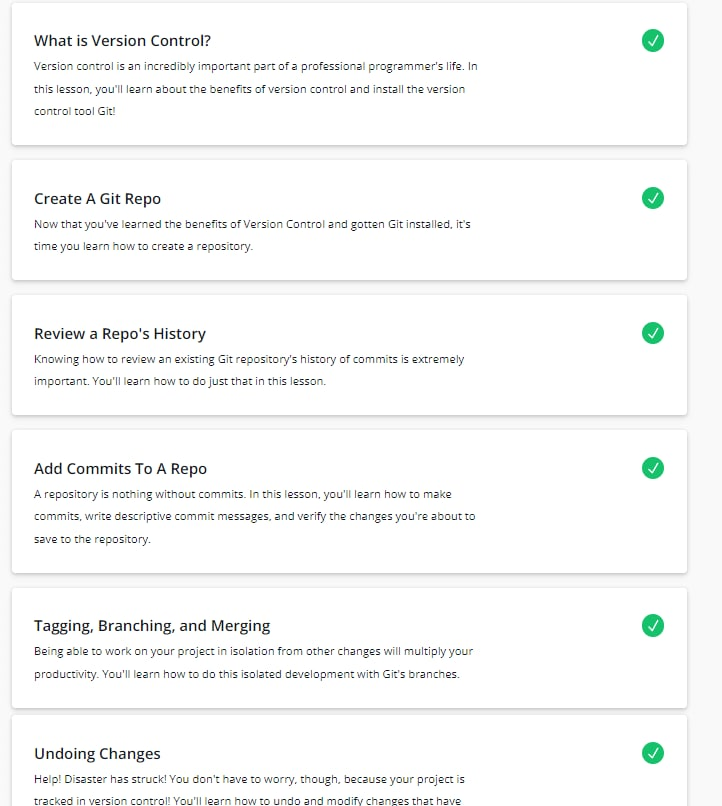

### 2.Complete the following levels here at [learngitbranching.js.org](https://learngitbranching.js.org/)

Unusual presentation of material in the form of diagrams. A little more difficult than on Udacity, but it helps to remember commands better.

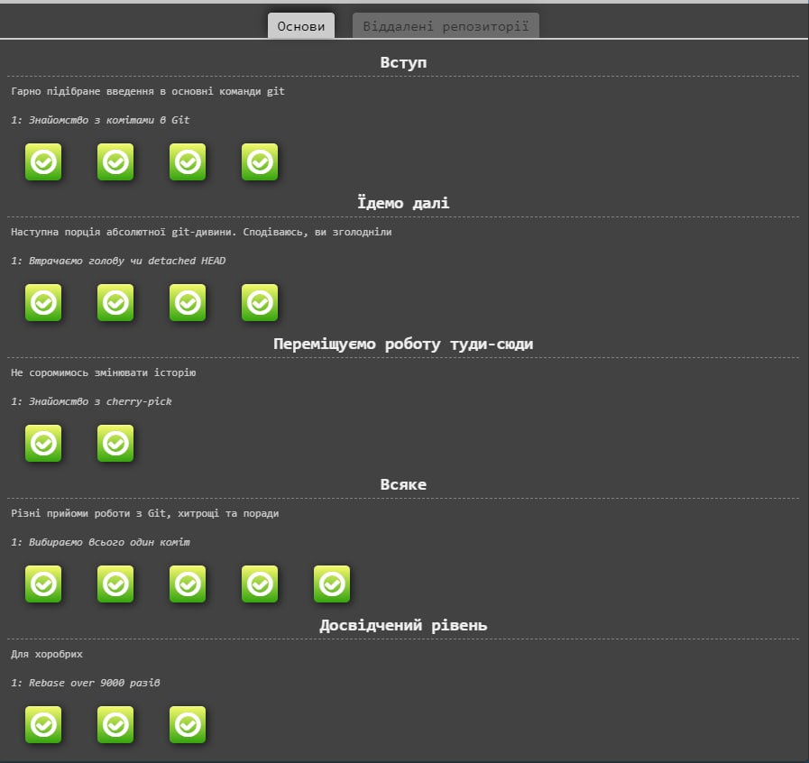

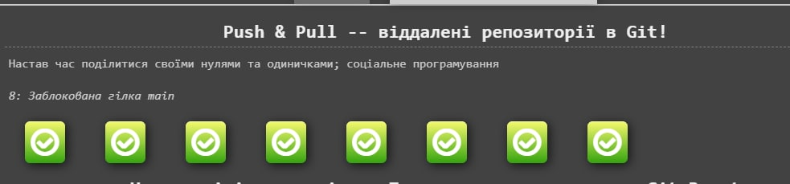

---

## Linux CLI, and HTTP 

### 1.[Linux Survival (4 modules)](https://linuxsurvival.com/linux-tutorial-introduction/)

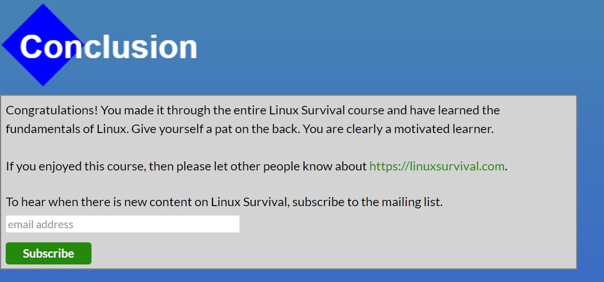

Learned many new Linux commands

### 2.[HTTP: Протокол, який повинен розуміти кожний веб-розробник (Частина 1)](https://code.tutsplus.com/uk/tutorials/http-the-protocol-every-web-developer-must-know-part-1--net-31177)
### 3.[HTTP: Протокол, який повинен розуміти кожний веб-розробник (Частина 2)](https://code.tutsplus.com/uk/tutorials/http-the-protocol-every-web-developer-must-know-part-2--net-31155)

It was interesting to learn how everything works "under the hood". Lots of new and useful information.

---

## Git Collaboration

### 2. Complete the following levels here at [learngitbranching.js.org](https://learngitbranching.js.org/)

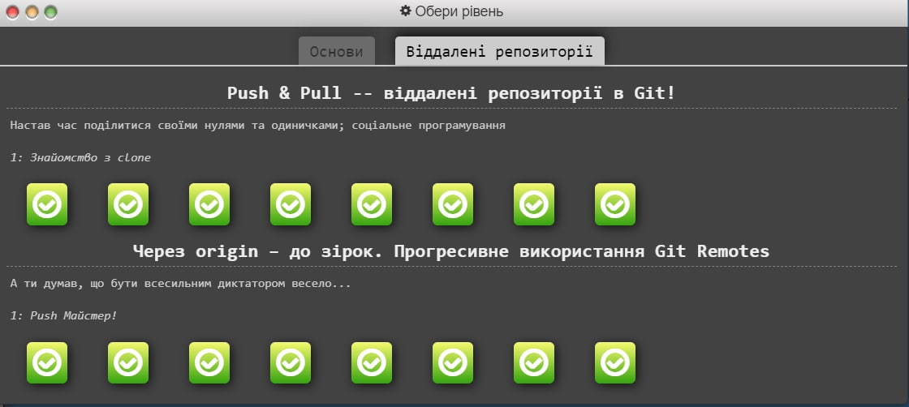

Working with Git is something! Difficult, but interesting. Delighted with such a system. 
Of course, I'll use Git in the future for the work of education, wherever it's fast and convenient.

---

## Intro to HTML and CSS

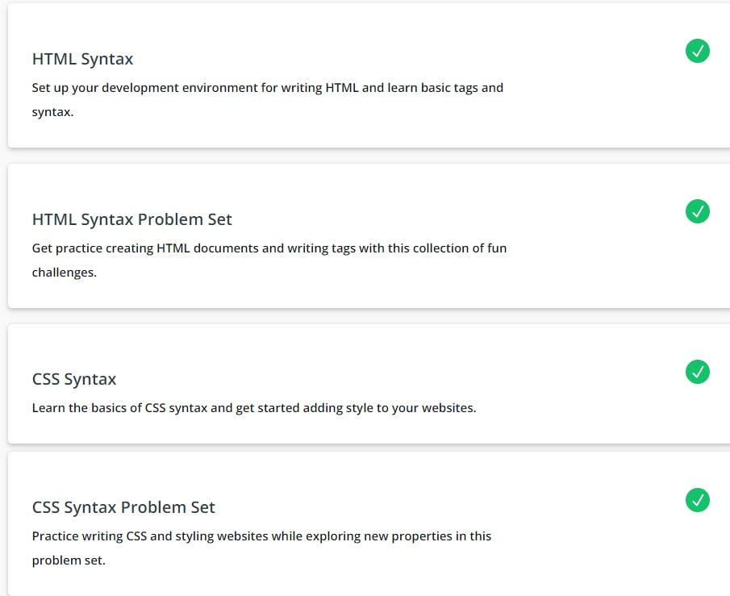

I did not like the Udacity part of the course at all. Too much "water" and an inconvenient code editor.

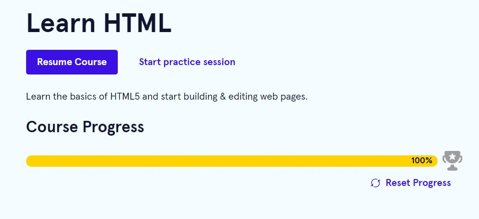

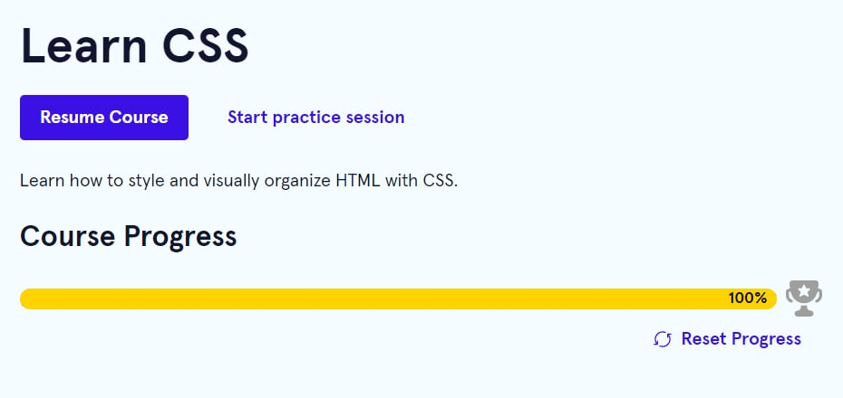

[Codeacademy](https://www.codecademy.com/learn) is a great platform for learning web languages. A convenient interactive part and a normal amount of theory.

---

## Responsive Web Design

[Responsive web design basics](https://web.dev/i18n/en/responsive-web-design-basics/)

The article contains many examples and features of how to make your site responsive. I will definitely save and look at it when creating the site

[Flexbox Froggy](http://flexboxfroggy.com/)

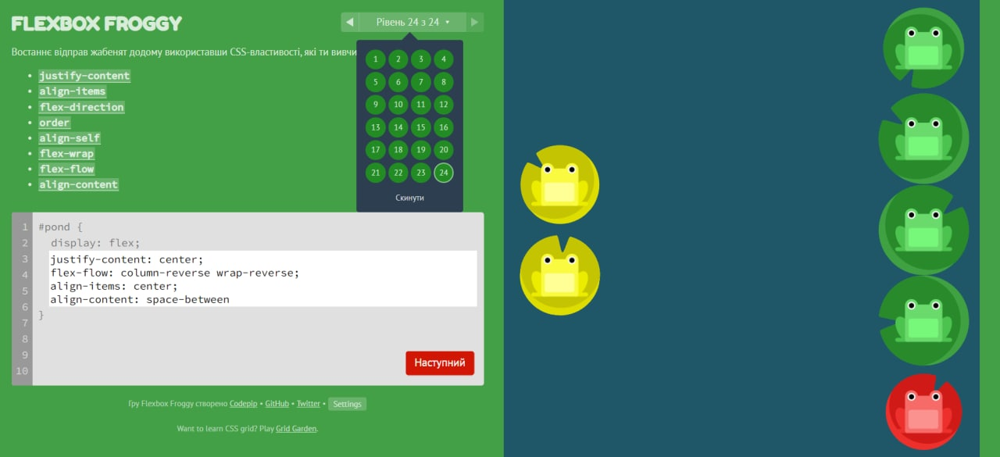

[Grid Garden](http://cssgridgarden.com/)

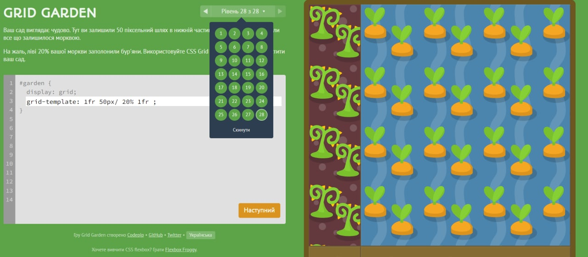

Great sites for understanding how flex and grid work.

---

## HTML-CSS-Popup

[Demo](https://pozzitive11.github.io/pure-popup/) |
[Code base](https://github.com/Pozzitive11/pure-popup)

It was interesting, but quite a difficult task. Especially understanding how to make a checkbox correctly

---

## JS Basics

[Introduction to JS](https://www.coursera.org/learn/html-css-javascript-for-web-developers/home/week/4)

I did not like the Courser course. Information is presented chaotically and uninterestingly

1. [Basic JavaScript](https://learn.freecodecamp.org/javascript-algorithms-and-data-structures/basic-javascript/) Easy exercises for familiarizing yourself with JS
2. [ES6 Challenges](https://learn.freecodecamp.org/javascript-algorithms-and-data-structures/es6/) It is well done that the new features are in a separate section
3. [Basic Data Structures](https://learn.freecodecamp.org/javascript-algorithms-and-data-structures/basic-data-structures/) Interaction with arrays and objects. Interesting exercises to consolidate the acquired knowledge
4. [Basic Algorithm Scripting](https://learn.freecodecamp.org/javascript-algorithms-and-data-structures/basic-algorithm-scripting/) Here it was more difficult, you had to turn on your head and remember everything you learned
5. [Functional Programming](https://learn.freecodecamp.org/javascript-algorithms-and-data-structures/functional-programming/) Understanding how functions work and their work.
6. [Algorithm Scripting Challenges](https://learn.freecodecamp.org/javascript-algorithms-and-data-structures/intermediate-algorithm-scripting) It was the most difficult, I completed all the tasks, but I will have to go through this section again

_Link to the folder with screenshots of completed tasks_  [here](https://github.com/Pozzitive11/kottans-frontend/tree/main/task_js_basics)

---

## DOM 

[Demo](https://pozzitive11.github.io/dom-js/) |
[Code base](https://github.com/Pozzitive11/dom-js)

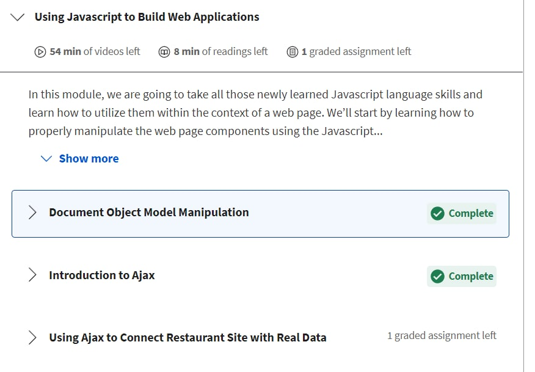

Part of the course on [coursera](https://www.coursera.org/learn/html-css-javascript-for-web-developers/home/week/5) turned out to be quite interesting and useful

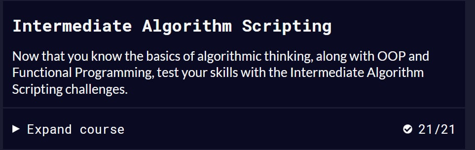

Tasks on [freecodecamp](https://learn.freecodecamp.org/javascript-algorithms-and-data-structures/intermediate-algorithm-scripting) were quite difficult, it is worth going through them again later

## Tiny Js World

[Demo](https://pozzitive11.github.io/a-tiny-JS-world/) |
[Code base](https://github.com/Pozzitive11/a-tiny-JS-world)

---

## Object Oriented JS

[Videos about OOP](https://www.youtube.com/watch?v=jgCiWIdUZ-s&list=PLM7wFzahDYnEltE-aVGhRHYPwIJn0Xquu&index=40) were interesting. I learned what classes are and how to use them

[Codewars](https://www.youtube.com/watch?v=jgCiWIdUZ-s&list=PLM7wFzahDYnEltE-aVGhRHYPwIJn0Xquu&index=40) tasks are very interesting! I will solve them in my free time

### Frogger-game

When creating the game, I learned how to work with coordinates, repeated Classes once again and learned to understand someone else's code

[Demo](https://pozzitive11.github.io/frogger-game-/) |
[Code base](https://github.com/Pozzitive11/frogger-game-)

---

## OOP exercise

Learned a lot about OOP. Not the first time, but used the Dry and SOLID principles

[Demo](https://pozzitive11.github.io/tiny-JS-world-OOP-/) |
[Code base](https://github.com/Pozzitive11/tiny-JS-world-OOP-)

## Memory – Pair Game

One of the most interesting tasks. Developing games and working with javascript in a new way for me - that's what I wanted!

[Demo](https://pozzitive11.github.io/memory-game/) |
[Code base](https://github.com/Pozzitive11/memory-game)

## Friends App

The icing on the course cake. Collect all knowledge and implement it in one project. It was really exciting!

[Demo](https://pozzitive11.github.io/friends-app/) |
[Code base](https://github.com/Pozzitive11/friends-app)